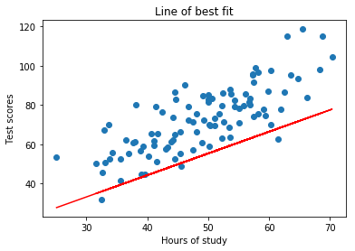

```python
# linear regression demo
```

## imports


```python
from numpy import *
import matplotlib.pyplot as plt
```

## loading data


```python
points = genfromtxt('data.csv', delimiter=',')

#extract columns
x = array(points[:, 0])
y = array(points[:, 1])
```

## plot the dataset


```python
plt.scatter(x,y)
plt.xlabel('Hours of study')
plt.ylabel('Test scores')
plt.title('Dataset')
plt.show()
```


#hyperparamters


```python
learning_rate = 0.0001
initial_b = 0
initial_m = 0
num_iterations = 10
```


```python
def update_graph(b, m):
    print('current b: {0}'.format(b))
    print('current m: {0}'.format(m))
    #Plot dataset
    plt.scatter(x, y)
    #Predict y values
    pred = m * x + b
    #Plot predictions as line of best fit
    plt.plot(x, pred, c='r')
    plt.xlabel('Hours of study')
    plt.ylabel('Test scores')
    plt.title('Line of best fit')
    plt.show()
```

## define cost function


```python
def compute_cost(b, m, points):
    total_cost = 0
    N = float(len(points))
    
    # compute sum of squared errors
    for i in range(0, len(points)):
        x = points[i, 0]
        y = points[i, 1]
        total_cost += (y - (m * x + b)) ** 2
    return total_cost / N
```


```python
## Define desence functions
```


```python
def gradient_descent_runner(posints, starting_b, starting_m, learning_rate, num_iterations):
    b = starting_b
    m = starting_m
    cost_graph = []
    
    for i in range(num_iterations):
        cost_graph.append(compute_cost(b, m, points))
        b, m = step_gradient(b, m, array(points), learning_rate)
        update_graph(b, m)
        
    return [b, m, cost_graph]   
```


```python
def step_gradient(current_b, current_m, points, learning_rate):
    m_gradient = 0
    b_gradient = 0
    N = float(len(points))
    
    for i in range(0, len(points)):
        x = points[i, 0]
        y = points[i, 1]
        m_gradient += - (2/N) * x * (y - (current_m * x + current_b))
        b_gradient += - (2/N) * (y - (current_m * x + current_b))
        
    m_updated = current_m - learning_rate * m_gradient
    b_updated = current_b - learning_rate * b_gradient
    
    return b_updated, m_updated
```


```python
def main():
    b, m, cost_graph = gradient_descent_runner(points, initial_b, initial_m, learning_rate, num_iterations)
    print('optimized b: {0}'.format(b))
    print('optimized m: {0}'.format(m))
    plt.plot(cost_graph)
    plt.xlabel('No. of iterations')
    plt.ylabel('Cost')
    plt.title('Cost per iteration')
    plt.show()
```


```python
if __name__ == "__main__":
    main()
```

    current b: 0.014547010110737297
    current m: 0.7370702973591052


    current b: 0.02187396295959641
    current m: 1.1067954543515157





    current b: 0.025579224321293136
    current m: 1.2922546649131115


    current b: 0.027467789559144355
    current m: 1.385283255651245


    current b: 0.028445071981738963
    current m: 1.4319472323843205


    current b: 0.02896524076647862
    current m: 1.4553540088980408


    current b: 0.0292561141260467
    current m: 1.4670946177201354


    current b: 0.02943196916380713
    current m: 1.4729832982243762


    current b: 0.029550129024383073
    current m: 1.4759365618962286


    current b: 0.02963934787473239
    current m: 1.4774173755483797


    optimized b: 0.02963934787473239
    optimized m: 1.4774173755483797


